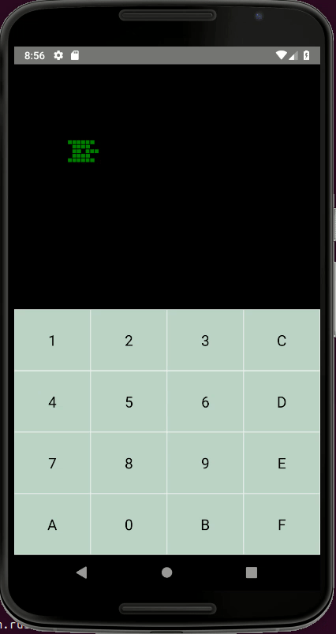

## A Chip8 Emulator for Android written Rust and React Native.(On going)



### What is CHIP-8?
Chip-8 is a simple, interpreted, programming language which was first used on some do-it-yourself computer systems in the late 1970s and early 1980s. The COSMAC VIP, DREAM 6800, and ETI 660 computers are a few examples. These computers typically were designed to use a television as a display, had between 1 and 4K of RAM, and used a 16-key hexadecimal keypad for input. The interpreter took up only 512 bytes of memory, and programs, which were entered into the computer in hexadecimal, were even smaller.
CHIP-8 was mainly used as a gaming platform, and today you can play lots of games like Pong and Breakout on it.

### References
[Cowgod's Chip-8 Reference](http://devernay.free.fr/hacks/chip8/C8TECH10.HTM)
[How to write an emulator](http://www.multigesture.net/articles/how-to-write-an-emulator-chip-8-interpreter/)

[Building and Deploying a Rust library on Android](https://mozilla.github.io/firefox-browser-architecture/experiments/2017-09-21-rust-on-android.html)
[Android NDK reference](https://developer.android.com/ndk/reference)
[Rust FFI](https://doc.rust-lang.org/nomicon/ffi.html)

### Dependencies
This app depends on an installation of Android Studio for Android .
Additionally the Android deployment requires the SDK for Android API 28 and the Android NDK to be installed.

You also need to install necessary rust target: 
```bash
$ rustup target add i686-linux-android
$ rustup target add arm-linux-androideabi
$ rustup target add armv7-linux-androideabi
$ rustup target add aarch64-linux-android
$ rustup target add x86_64-linux-android
```
### Building
 - Installing NPM dependencies: npm install
 - Creating stand alone NDK: $./create-ndk-standalone.sh
 - Compiling Rust libs and copy them to jniLibs: ./auto_build.sh
 - Run: $react-native run-android (remember to start react-native server before using this command).

